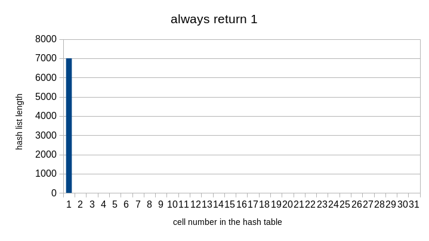
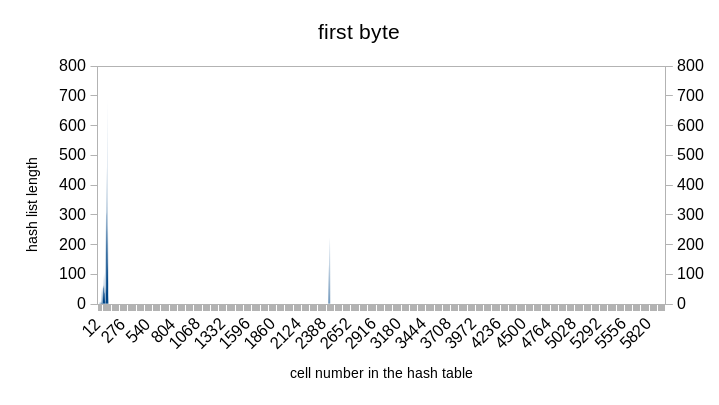
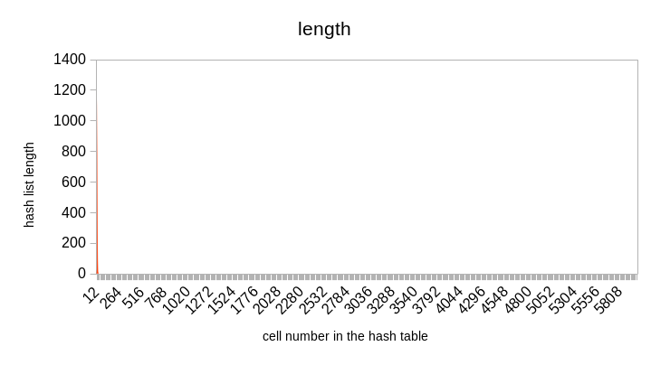

# Хэш-таблица
## О проекте
This project implements a hash table using the chain method. In the first part of the project, a study of the effectiveness of several hash functions was conducted. In the second part, optimization was carried out using three methods: 1) AVX optimization; 2) assembler insertion; 3) replacement of some function with its own, which is written in assembler.

## Часть 1 - исследование хэш-фукнций
### Возвращает 1
Ох... 😬 Эта хэш-функция самая ужасная в этой подборке.
<details>
  <summary>Код функции</summary>
  
  ```c
  size_t hashRet1 (char * word, size_t length)
  {
      MY_ASSERT (word == nullptr, "There is no access to the word");

      return 1;
  }
  ```
  
</details>



### Возвращает 1-ый байт слова
Чуть лучше, чем предыдущая, для узкого круга задач она может подойти. Но всё равно безумное количество коллизий. 
<details>
  <summary>Код функции</summary>
  
  ```c
  size_t hashFirstByte (char * word, size_t length)
  {
      MY_ASSERT (word == nullptr, "There is no access to the word");
      return word[0];
  }
  ```
  
</details>



### Возвращает длину слова
Хэш-функция так же плоха, но... она хотя бы представляет интерес в научном плане: теперь мы знаем среднюю длину слова в английском тексте :grin:

<details>
  <summary>Код функции</summary>
  
  ```c
  size_t hashLength (char * word, size_t length)
  {
      MY_ASSERT (word == nullptr, "There is no access to the word");
      return length;
  }
  ```
  
  
  
<\details>
