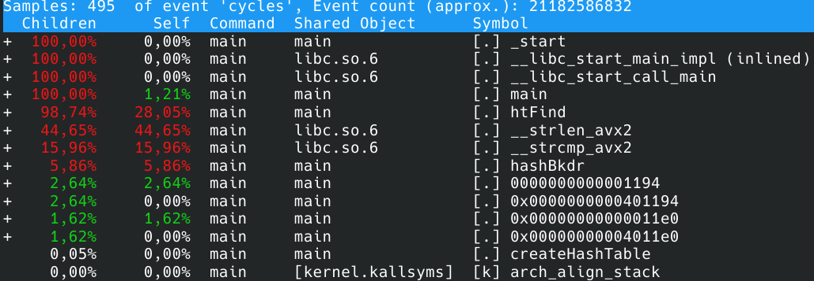
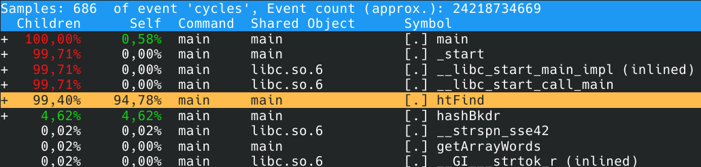
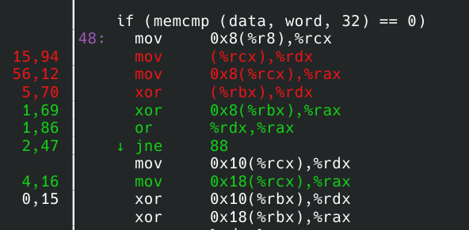
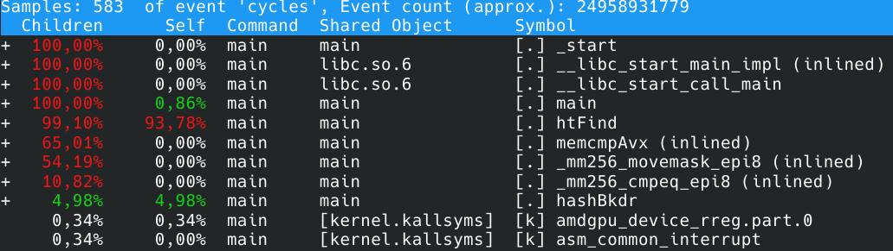
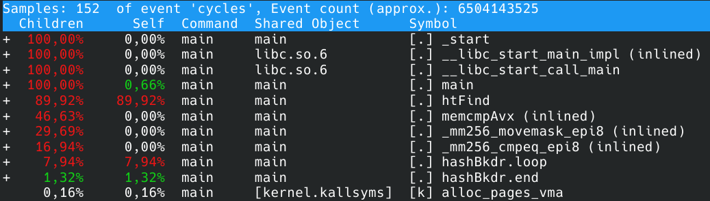

# Хэш-таблица
## О проекте
В этом проекте реализована хэш-таблица с обработкой коллизий методом цепочек. В первой части проекта было проведено исследование эффективности нескольких хэш-функций. Во второй части проводилась оптимизация с помощью:
1) AVX-инструкций;
2) вставки фрагмента кода на ассемблере;
3) замены хэш-функцию на её ассемблерную версию;
4) алгоритмических оптимизаций.

## Теоретическое отступление
Для тех, кто впервые встретился с этим понятием, быстро объясню суть хэш-таблиц.

*Хэш-таблица* - это структура данных, в которой информация хранится парами: первый элемент - "ключ", второй - "значение". Поиск по хэш-таблице начинается с высчитывания значения хэш-функции от ключа. Полученное значение будет являться индексом ячейки в хэш-таблице, где лежит информация, соответствующая этому ключу. Пример, на котором всё станет ясно. Пусть есть дом, в нём 4 комнаты: "зелёная", "красная", "синяя", "серая". В "серой" комнате лежит гора алмазов, в "синей" - гора сапфиров, в "красной" - гора рубинов, в "зелёной" - гора изумрудов. Предположим, что функция, когда ей передаешь слово "зелёная", возвращает 0, когда передаёшь "красная" - возвращает 1, когда передаёшь "синяя" - возвращает 2, когда передеаёшь "серая" - возвращает 3. Эти значения и будут индексами в соответствующей хэш-таблице, которая будет иметь вид:
| 0 | 1 | 2  | 3 |
| ------------- | ------------- | ------------- | ------------- |
| "зелёная"  | "красная"  | "синяя"  | "серая"  |
| изумруды  | рубины  | сапфиры  | алмазы  |

То есть время поиска по ней будет составлять O(1) - просто назовите слово и получите всю информацию, которая ему соответствует. Для оптимизации поиска и используют хэш-таблицы.

## Часть 1 - исследование хэш-фукнций
### Hash function returning 1
Эта хэш-функция самая плохая из тех, что здесь представлены. Она всегда возвращает 1.

```c
size_t hashRet1 (char * word, size_t length)
{
    return 1;
}
```

### Hash function returning 1-st byte
Чуть лучше, чем предыдущая, возвращает 1-ый байт слова в кодировке ASCII. Для узкого круга задач она может подойти, но всё равно безумное количество коллизий.

```c
size_t hashFirstByte (char * word, size_t length)
{
    return word[0];
}
```

### HashLength
Возвращает длину слова. Хэш-функция так же плоха, но... она хотя бы представляет интерес в научном плане: теперь мы знаем среднюю длину слова в английском тексте.

```c
size_t hashLength (char * word, size_t length)
{
    return length;
}
```

### HashSum
Возвращает сумму ASCII-кодов букв слова. Ситуация становится лучше.

```c
size_t hashSumAscii (char * word, size_t length)
{
    size_t sum = 0;
    for (size_t i = 0; i < length; i++)
    {
        sum += word[i];
    }

    return sum;
}
```

### HashRol
Использует операцию rol. Вполне приемлемая функция, коллизий не так много по сравнению с предыдущими функциями.

```cтакая
size_t hashRol (char * word, size_t length)
{
    size_t h = 0;
    for (size_t i = 0; i < length; i++)
    {
        h = rol(h)^word[i];
    }
    return h;
}
```

### HashRor
Использует операцию ror. Несколько хуже предыдущей, но использовать в некоторых задачах можно.

```c
size_t hashRor (char * word, size_t length)
{
    size_t h = 0;
    for (size_t i = 0; i < length; i++)
    {
        h = ror(h)^word[i];
    }
    return h;
}
```

### HashBkdr
Реализация хэш-функции BKDR. Лучшая функция в этой подборке.

```c
size_t hashBkdr (char * word, size_t lengthWord)
{
    unsigned int seed = 131;
    unsigned int hash = 0;

    while (*word){
        hash = hash * seed + (*word++);
    }

    return (hash & 0x7FFFFFFF);
}
```

## Вывод

Графики распределения соответствующих хэш-функций.


Лучше всего себя показала последняя хэш-функция - BKDR. Именно её из всех предложенных я бы советовал использовать при анализе текста, так как поиск по хэш-таблице, полученной с её использованием, будет достаточно быстрым.

## Часть 2 - оптимизация

### Как проводилась обработка

Для профилирования использовался perf, запись данных происходила с помощью команды
```
perf record -g --call-graph dwarf -F 99 <a name of the executable file>
```
Важно, чтобы имя исполняемого файла находилось после используемых флагов, так как в противном случае всё, что будет после имени учитываться при сборе информации не будет. Результат выводился с помощью команды
```
sudo perf report -g
```
Время работы и прочая статистика собиралась с помощью команды
```
perf stat -r 10 <a name of the executable file>
```
Благодаря флагу `-r` выводится среднее значение и стандартное отклонение. Пример для базовой версии:


### Версия 0
Поправки: 
    - размер хэш-таблицы составляет 107 ячеек;
    - оставлена единственная хэш-функция hashBkdr;
    - добавлен стресс-тест.

Стресс-тест представляет собой поиск всех слов из текста, уникальных из которых приблизительно 8000, 1000 раз. Выбран этот способ измерений потому, что всегда искать лишь одно слово - значит постоянно работать только с одной ячейкой хэш-таблицы, тогда как нам нужна эффективность поиска в среднем.

Скомпилируем программу:
```
make
```
и запустим с помощью профилировщика.

Время работы: `5.65` секунд.

Самый простой способ оптимизировать программу - добавить ключ `-O2` или `-O3`. Это сделаем и мы. Все результаты сведём в таблицу:

|| O0  | O2 | O3 |
|--| -- | -- | -- |
|Время работы: | 5.65 | 4.99 |  5.04  |

Эффективным оказался флаг `-O2`. Сохраним его и исследуем программу на узкие места:



Такие функции как `_start`, `__libc_start_main_impl` и `__libc_start_call_main` являются служебными и оптимизировать мы их не будем. Функция `main` работает всего лишь `1.21%` от общего времени, оптимизировать её тоже не имеет смысла, а вот к её потомкам приглядеться стоит.
Видим, что функция `htFind` - в дальнейшем "базовая версия функции поиска" - является самой горячей. Вот как она выглядит (логирование и обработка ошибок на время тестирования отключены):

```c
struct listElement_t * htFind (htMainElem hashtable, char * word)
{
    MY_ASSERT (word == nullptr, "There is no access to this word");

    size_t index = hashBkdr (word) % hashtable.capacity;
    size_t lengthList = hashtable.htElem[index].size;
    listElement_t * listElem = hashtable.htElem[index].ptrToList->next; 

    size_t lengthWord = strlen (word);
    char * data = nullptr;

    for (size_t i = 0; i < lengthList; i++)
    {
        data = listElem->data;

        if (strlen(data) != lengthWord)
        {
            listElem = listElem->next;
            continue;
        }

        if (strcmp (data, word) == 0)
        {
            return listElem;
        }

        listElem = listElem->next;
    }

    return nullptr;
}
```

Из данных, полученных с помощью perf, мы видим, что `1.26%` времени тратится на загрузку данных в переменные, счётчики циклов и прочее, а `98.74%` тратится на функций-потомков: `__strlen_avx2`, `__strcmp_avx2`, `hashBkdr`. Отметим, что мы не использовали в теле функции avx2-оптимизацию функций `strlen` и `strcmp`, это сделал компилятор. Попробуем оптимизировать работу функции `htFind`, избавившись от функции `strlen` и представив эквивалент функции `strcmp`, который будет более уместным в данном случае.

### Версия 1

Поправки:
    - благодаря предварительной обработке текста все слова хранятся в 32-байтных областях.

Время работы: `7.09` секунд. 

Поскольку длина слов постоянна, то лучше будет заменить функцию `strcmp` на функцию `memcmp` - это должно быть быстрее.
Теперь функция `htFind` выглядит так:

```c
struct listElement_t * htFind (htMainElem hashtable, __m256i * word)
{
    MY_ASSERT (word == nullptr, "There is no access to this word");

    size_t index = hashBkdr ((char *)word) % hashtable.capacity;
    size_t lengthList = hashtable.htElem[index].size;
    listElement_t * listElem = hashtable.htElem[index].ptrToList->next; 

    __m256i * data = nullptr;

    for (size_t i = 0; i < lengthList; i++)
    {  
        data = listElem->data;

        if (memcmp (data, word, 32) == 0)
        {
            return listElem;
        }
        listElem = listElem->next;
    }

    return nullptr;
}
```

Время работы: `6.05` секунд. Относительное ускорение есть, а абсолютного - нет...

Посмотрим на данные профилировщика:



Хм... Функции `memcmp` нет в списке исполняемых. Посмотрим на дизассемблер функции `htFind`:



Хах, компилятор встроил функцию `memcmp` в код программы! Попробуем повысить эффективность, написав свои аналоги этой функции.

Сначала реализуем её с помощью ассемблерной вставки:
```c
inline static int memcmpAsm (const void * str1, const void * str2, size_t length)
{
    int result = 0; 

    asm
    (
        ".intel_syntax noprefix\n\t"
        "cld\t\n"
        "mov %0, 1\t\n"
        "repe cmpsb\t\n"
        "je 1f\t\n"
        "jmp 2f\t\n"
        "1:\t\n"
        "xor %0, %0\t\n"
        "2:\t\n"
        ".att_syntax\t\n"
        : "=a" (result)
        : "S" (str1), "D" (str2), "c" (length)
    );

    return result;
}
```

Время работы: `39.74` секунды. 

Эта оптимизация себя не оправдала. Напишем фукнцию memcmp с помощью avx2 инструкций:

```c
static int memcmpAvx (const __m256i * ar1, const __m256i * ar2)
{
    __m256i cmp = _mm256_cmpeq_epi8 (*ar1, *ar2);
    unsigned int mask = (unsigned int) _mm256_movemask_epi8 (cmp);

    if (mask == 0xffffffff)
    {
        return 0;
    }
    return 1;
}
```

Время работы: `5.90` секунды. Неплохо :) Попробуем ещё больше оптимизировать: уберём лишние обращения к памяти, сделав функцию `memcmpAvx` inline-функцией.

Время работы: `5.75` секунды. Запустим теперь программу с помощью профилировщика, чтобы найти узкие места:



Мы не притрагивались только к функции `hashBkdr`. Так давайте исправим это :)

### Версия 2

Поправки:
    - функция хэширования переведена на ассемблер.

Ниже приведён код этой функции:
```asm
hashBkdr:                   ; avoiding registers that we have to keep
   xor rax, rax             ; hash
   xor rcx, rcx

.loop:
   movzx rcx, byte [rdi]    ; word

   jrcxz .end

   mov r8, rax
   shl rax, 7
   add rax, r8              ; rax * 131
   add rax, r8
   add rax, r8

   lea rax, [rax + rcx]
   inc rdi
   jmp .loop

.end:
   and eax, 0x7fffffff

   ret
```

Время работы: `5.65` секунды.
Относительное ускорение: .
Абсолютное ускорение: .

Запустим программу с помощью профилировщика и посмотрим результат:



Мы оптимизировали все существенные части в функции поиска. Попробуем последнее, что её не касается: увеличим размер хэш-таблицы приблизительно в 10 раз.

Время работы: `1.58` секунды.
Относительное усорение: ``
Абсолютное ускорение: ``. 

Результат понятен: производится меньше сравнений внутри списка, соответствующего ячейке хэш-таблице, что сильно ускоряет работу программы.

Ради опыта скомпилируем с флагом `-O3` и запустим.
Время работы: `1.60` секунды, сравнимый с предыдущим результат. Отсюда видно, что флаг `-O3` не всегда даёт прирост производительности, по сравнению с флагом `-O2`. Более того, лучше использовать флаг `-O2`, потому что он гарантирует безопасность при оптимизации.

Итоговое усорение: `3.88` раза.

### Вывод

Общий прирост скорости составляет 388% по тактам. Рассчитаем коэффициент Деда по формуле:

$\frac{\text{acceleration value}}{\text{number of assembly lines}} \cdot 1000$.

Не будем учитывать имена меток, названия функций и комментарии. Таким образом, получим:

$\frac{3.88}{18} \cdot 1000 = 215.55$

Из всех оптимизаций видно, что наибольшую дают изменения, связанные с алгоритмической частью.
