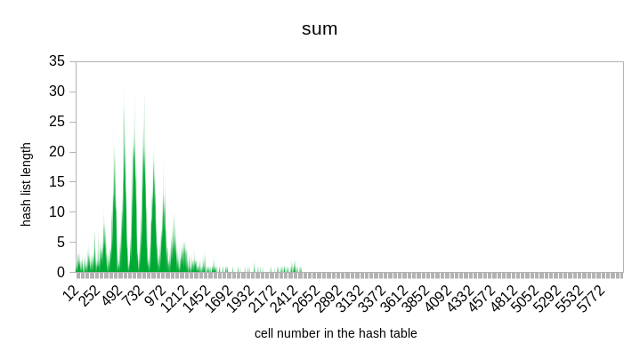
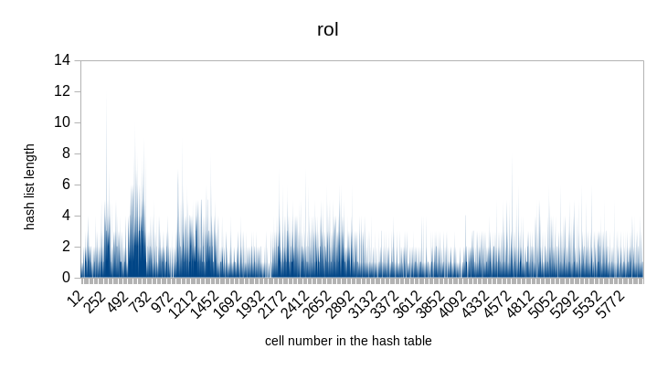
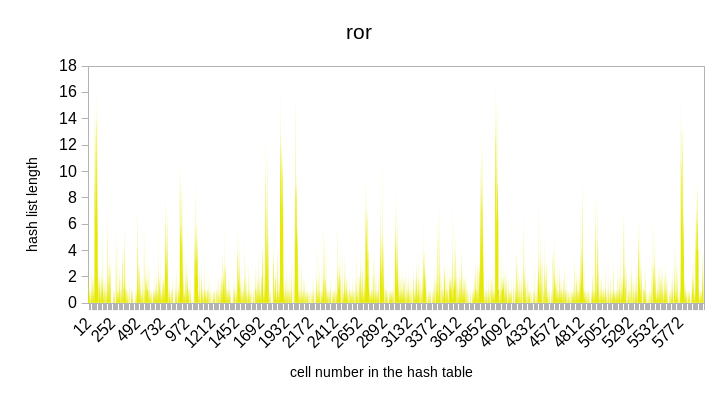
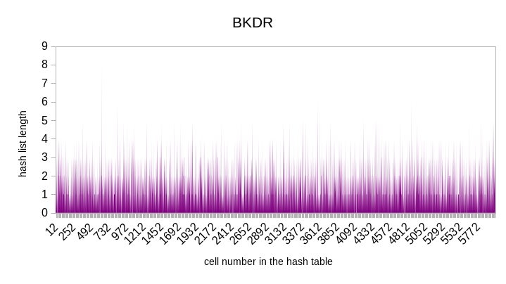

# Хэш-таблица
## О проекте
В этом проекте реализована хэш-таблица с обработкой коллизий методом цепочек. В первой части проекта было проведено исследование эффективности нескольких хэш-функций. Во второй части оптимизация проводилась с использованием трех методов: 
1) оптимизация AVX; 
2) вставка фрагмента кода на ассемблере; 
3) замена некоторой функции на собственную, которая написана на ассемблере.

## Теоретическое отступление
Для тех, кто впервые встретился с этим понятием, быстро объясню суть хэш-таблиц.

*Хэш-таблица* - это структура данных, в которой информация хранится парами: первый элемент - "ключ", второй - "значение". Поиск по хэш-таблице начинается с высчитывания значения хэш-функции от ключа. Полученное значение будет являться индексом ячейки в хэш-таблице, где лежит информация, соответствующая этому ключу. Пример, на котором всё станет ясно. Пусть есть дом, в нём 4 комнаты: "зелёная", "красная", "синяя", "серая". В "серой" комнате лежит гора алмазов, в "синей" - гора сапфиров, в "красной" - гора рубинов, в "зелёной" - гора изумрудов. Предположим, что функция, когда ей передаешь слово "зелёная", возвращает 0, когда передаёшь "красная" - возвращает 1, когда передаёшь "синяя" - возвращает 2, когда передеаёшь "серая" - возвращает 3. Эти значения и будут индексами в соответствующей хэш-таблице, которая будет иметь вид:
| 0 | 1 | 2  | 3 |
| ------------- | ------------- | ------------- | ------------- |
| "зелёная"  | "красная"  | "синяя"  | "серая"  |
| изумруды  | рубины  | сапфиры  | алмазы  |

То есть время поиска по ней будет составлять O(1) - просто назовите слово и получите всю информацию, которая ему соответствует.

## Часть 1 - исследование хэш-фукнций
### Hash function returning 1
Ох... 😬 Эта хэш-функция самая ужасная из тех, что вы увидите здесь. Она всегда возвращает 1.

```c
size_t hashRet1 (char * word, size_t length)
{
    return 1;
}
```


### Hash function returning 1-st byte
Чуть лучше, чем предыдущая, возвращает 1-ый байт слова в кодировке ASCII. Для узкого круга задач она может подойти, но всё равно безумное количество коллизий. 
  
```c
size_t hashFirstByte (char * word, size_t length)
{
    return word[0];
}
```


### HashLength
Возвращает длину слова. Хэш-функция так же плоха, но... она хотя бы представляет интерес в научном плане: теперь мы знаем среднюю длину слова в английском тексте :grin:

```c
size_t hashLength (char * word, size_t length)
{
    return length;
}
```


  
### HashSum
Возвращает сумму ASCII-кодов букв слова. Ситуация становится лучше.

```c
size_t hashSumAscii (char * word, size_t length)
{
    size_t sum = 0;
    for (size_t i = 0; i < length; i++)
    {
        sum += word[i];
    }

    return sum;
}
```



### HashRol
Использует операцию rol. Вполне приемлемая функция, коллизий не так много по сравнению с предыдущими функциями.

```cтакая
size_t hashRol (char * word, size_t length)
{
    size_t h = 0;
    for (size_t i = 0; i < length; i++)
    {
        h = rol(h)^word[i];
    }
    return h;
}
```



### HashRor
Использует операцию ror. Несколько хуже предыдущей, но использовать в некоторых задачах можно.

```c
size_t hashRor (char * word, size_t length)
{
    size_t h = 0;
    for (size_t i = 0; i < length; i++)
    {
        h = ror(h)^word[i];
    }
    return h;
}
```


### HashBkdr
Реализация хэш-функции BKDR. Лучшая функция в этой подборке.

```c
size_t hashBkdr (char * word, size_t lengthWord)
{
    unsigned int seed = 131;
    unsigned int hash = 0;

    while (*word){
        hash = hash * seed + (*word++);
    }

    return (hash & 0x7FFFFFFF);
}
```


## Вывод
Лучше всего себя показала последняя хэш-функция BKDR. Именно её из всех предложенных я бы советовал использовать при анализе текста, так как поиск по хэш-таблице, полученной с её использованием, будет достаточно быстрым.
