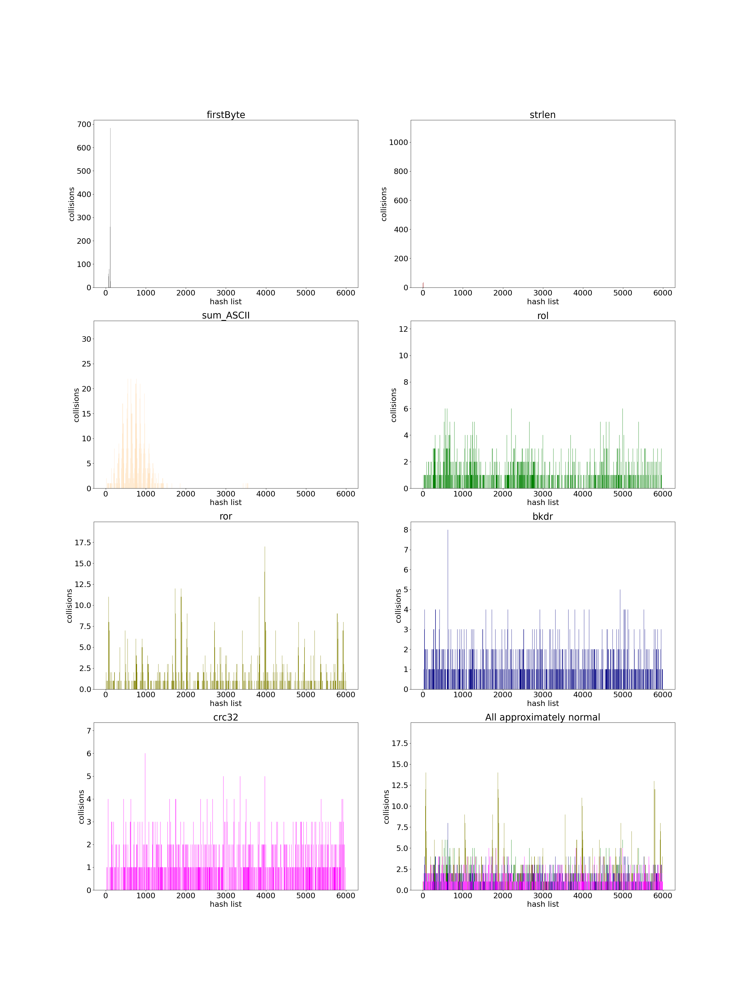
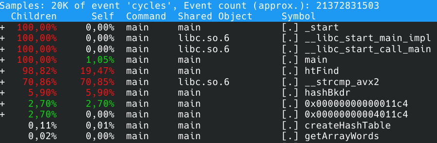

# Хэш-таблица
## О проекте
В этом проекте реализована хэш-таблица с обработкой коллизий методом цепочек. В первой части проекта было проведено исследование эффективности нескольких хэш-функций. Во второй части проводилась оптимизация с помощью:
1) AVX-инструкций;
2) вставки фрагмента кода на ассемблере;
3) замены хэш-функцию на её ассемблерную версию;
4) алгоритмических оптимизаций.

## Теоретическое отступление
Для тех, кто впервые встретился с этим понятием, быстро объясню суть хэш-таблиц.

*Хэш-таблица* - это структура данных, в которой информация хранится парами: первый элемент - "ключ", второй - "значение". Поиск по хэш-таблице начинается с высчитывания значения хэш-функции от ключа. Полученное значение будет являться индексом ячейки в хэш-таблице, где лежит информация, соответствующая этому ключу. Пример, на котором всё станет ясно. Пусть есть дом, в нём 4 комнаты: "зелёная", "красная", "синяя", "серая". В "серой" комнате лежит гора алмазов, в "синей" - гора сапфиров, в "красной" - гора рубинов, в "зелёной" - гора изумрудов. Предположим, что функция, когда ей передаешь слово "зелёная", возвращает 0, когда передаёшь "красная" - возвращает 1, когда передаёшь "синяя" - возвращает 2, когда передеаёшь "серая" - возвращает 3. Эти значения и будут индексами в соответствующей хэш-таблице, которая будет иметь вид:
| 0 | 1 | 2  | 3 |
| ------------- | ------------- | ------------- | ------------- |
| "зелёная"  | "красная"  | "синяя"  | "серая"  |
| изумруды  | рубины  | сапфиры  | алмазы  |

То есть время поиска по ней будет составлять O(1) - просто назовите слово и получите всю информацию, которая ему соответствует. Для оптимизации поиска и используют хэш-таблицы.

## Часть 1 - исследование хэш-фукнций
### Hash function returning 1
Эта хэш-функция самая плохая из тех, что здесь представлены. Она всегда возвращает 1.

```c
size_t hashRet1 (char * word, size_t length)
{
    return 1;
}
```
> Дисперсия = 7572.3

### Hash function returning 1-st byte
Чуть лучше, чем предыдущая, возвращает 1-ый байт слова в кодировке ASCII. Для узкого круга задач она может подойти, но всё равно безумное количество коллизий.

```c
size_t hashFirstByte (char * word, size_t length)
{
    return word[0];
}
```
> Дисперсия = 310.8

### HashLength
Возвращает длину слова. Хэш-функция так же плоха, но... она хотя бы представляет интерес в научном плане: теперь мы знаем среднюю длину слова в английском тексте.

```c
size_t hashLength (char * word, size_t length)
{
    return length;
}
```
> Дисперсия = 887.1

### HashSum
Возвращает сумму ASCII-кодов букв слова. Ситуация становится лучше.

```c
size_t hashSumAscii (char * word, size_t length)
{
    size_t sum = 0;
    for (size_t i = 0; i < length; i++)
    {
        sum += word[i];
    }

    return sum;
}
```
> Дисперсия = 11.8

### HashRol
Использует операцию rol. Вполне приемлемая функция, коллизий не так много по сравнению с предыдущими функциями.

```cтакая
size_t hashRol (char * word, size_t length)
{
    size_t h = 0;
    for (size_t i = 0; i < length; i++)
    {
        h = rol(h)^word[i];
    }
    return h;
}
```
> Дисперсия = 1.59

### HashRor
Использует операцию ror. Несколько хуже предыдущей, но использовать в некоторых задачах можно.

```c
size_t hashRor (char * word, size_t length)
{
    size_t h = 0;
    for (size_t i = 0; i < length; i++)
    {
        h = ror(h)^word[i];
    }
    return h;
}
```
> Дисперсия = 4.3

### HashBkdr
Реализация хэш-функции BKDR. Одна из лучших функций в этой подборке.

```c
size_t hashBkdr (char * word, size_t lengthWord)
{
    unsigned int seed = 131;
    unsigned int hash = 0;

    while (*word){
        hash = hash * seed + (*word++);
    }

    return (hash & 0x7FFFFFFF);
}
```
> Дисперсия = 1.1

### HashCrc32
По эффективности приблизительно такая же, что и функция `hashBkdr`. 

```c
size_t hashCrc32 (char * word)
{
    const unsigned char * ptr = (const unsigned char *) word;
    unsigned int crc = ~0U;

    for(size_t i = 0; i < KEY_SIZE; i++)
        crc = crc32Tab[(crc ^ *ptr++) & 0xFF] ^ (crc >> 8);

    return (size_t)(crc ^ ~0U);
}
```
> Дисперсия = 1.1

## Вывод

Графики распределения соответствующих хэш-функций.



Лучше всего себя показали две последние хэш-функции - `bkdr` и `crc32`. Именно их из всех предложенных я бы советовал использовать при анализе текста, так как поиск по хэш-таблице, полученной с её использованием, будет достаточно быстрым.

## Часть 2 - оптимизация

### Как проводилась обработка

Для профилирования использовался perf, запись данных происходила с помощью команды
```
perf record -g --call-graph dwarf -F 99 <a name of the executable file>
```
Важно, чтобы имя исполняемого файла находилось после используемых флагов, так как в противном случае всё, что будет после имени учитываться при сборе информации не будет. Результат выводился с помощью команды
```
sudo perf report -g
```
Время работы и прочая статистика собиралась с помощью команды
```
perf stat <a name of the executable file>
```
Благодаря флагу `-r` выводится среднее значение и стандартное отклонение. Пример для базовой версии:


### Версия 0
Поправки: 
- размер хэш-таблицы составляет 107 ячеек;
- оставлена единственная хэш-функция hashBkdr;
- добавлен стресс-тест.

Стресс-тест представляет собой поиск всех слов из текста, уникальных из которых приблизительно 8000, 1000 раз. Выбран этот способ измерений потому, что всегда искать одно и то же слово - значит постоянно работать только с одной ячейкой хэш-таблицы, тогда как нам нужна эффективность поиска в среднем, а на более низком уровне можно сказать, что появляются "горячие кэши".

Скомпилируем программу:
```
make
```
и запустим с помощью профилировщика.

Время работы: `5.64` секунды.

Самый простой способ оптимизировать программу - добавить ключ `-O2` или `-O3`. Это сделаем и мы. Все результаты сведём в таблицу:

|**Version**|**Abs. speedup**| **Rel. speedup** |
|:----------|:--------------:|:----------------:|
|-O0        |1               |       1          |
|-O2        |1.10            |       1.10       |


Сохраним эту оптимизацию при дальнейших исследованиях. Обратимся к данным профилировщика, чтобы найти узкие места:



Такие функции как `_start`, `__libc_start_main_impl` и `__libc_start_call_main` являются служебными и оптимизировать мы их не будем. Функция `main` работает всего лишь `1.05%` от общего времени, оптимизировать её тоже не имеет смысла, а вот к её потомкам приглядеться стоит.
Видим, что функция `htFind` является самой горячей. Вот как она выглядит (логирование и обработка ошибок на время тестирования отключены):

```c
struct listElement_t * htFind (htMainElem hashtable, char * word)
{
    MY_ASSERT (word == nullptr, "There is no access to this word");

    size_t index = hashBkdr (word) % hashtable.capacity;
    size_t lengthList = hashtable.htElem[index].size;
    listElement_t * listElem = hashtable.htElem[index].ptrToList->next; 

    char * data = nullptr;

    for (size_t i = 0; i < lengthList; i++)
    {
        data = listElem->data;

        if (strcmp (data, word) == 0)
        {
            return listElem;
        }

        listElem = listElem->next;
    }

    return nullptr;
}
```

Из данных, полученных с помощью perf, мы видим, что `1.26%` времени тратится на загрузку данных в переменные, счётчики циклов и прочее, а `98.74%` тратится на функций-потомков: `__strlen_avx2`, `__strcmp_avx2`, `hashBkdr`. Отметим, что мы не использовали в теле функции avx2-оптимизацию функций `strlen` и `strcmp`, это сделал компилятор. Попробуем оптимизировать работу функции `htFind`, избавившись от функции `strlen` и представив эквивалент функции `strcmp`, который будет более уместным в данном случае.

Мы видим, что сама функция `htFind` занимает `19.47%` - это загрузка данных в переменные, работа циклов и прочие накладные расходы, оптимизировать которые мы не можем. Обратим внимание на более существенную деталь - функцию `__strcmp_avx2`. Мы её не использовали, это компилятор подставил вместо функции `strcmp` её avx-аналог. И так происходит всегда! Даже при флаге `-O0`. Посоревнуемся с ней.

### Версия 1

Поправки:
- благодаря предварительной обработке текста все слова хранятся в 32-байтных областях.

Мы написали небольшую программу на Python, которая форматирует исходный текстовый файл таким образом, что все слова (непрерывные последовательности букв и цифр) дополнены символом `\0` до 32 байтов, что при парсинге этого текста позволило нам уложить слова в 32-байтные области, выровненные по этим же 32 байтам. Теперь так выглядит наш код (точки = `\0`):


Выравнивание - обязательный шаг в процессе перехода на **simd-инструкции**. Делается это с помощью функции [aligned_alloc](https://en.cppreference.com/w/c/memory/aligned_alloc). Отмечу частую ошибку, которую и сам допустил: не получится выровнить статическую память, только динамическую! Кажется, что незаурядное утверждение, но времени начинающим программистам может сэкономить порядочно. 

Поскольку длина слова постоянная, то логичным решением будет заменить функцию `strcmp` на функцию `memcmpAvx` - аналог функции `memcmp` на simd-инструкциях, написанный конкретно для нашего случая.

```c
static int memcmpAvx (const __m256i * ar1, const __m256i * ar2)
{
    __m256i cmp = _mm256_cmpeq_epi8 (*ar1, *ar2);
    unsigned int mask = (unsigned int) _mm256_movemask_epi8 (cmp);

    if (mask == 0xffffffff)
    {
        return 0;
    }
    return 1;
}
```

Теперь функция `htFind` выглядит так:

```c
struct listElement_t * htFind (htMainElem hashtable, char * word)
{
    MY_ASSERT (word == nullptr, "There is no access to this word");

    size_t index = hashBkdr (word) % hashtable.capacity;
    size_t lengthList = hashtable.htElem[index].size;
    listElement_t * listElem = hashtable.htElem[index].ptrToList->next; 

    char * data = nullptr;

    for (size_t i = 0; i < lengthList; i++)
    {
        data = listElem->data;
        if (memcmpAvx (data, word) == 0)
        {
            return listElem;
        }

        listElem = listElem->next;
    }

    return nullptr;
}
```

Время работы: `4.62` секунд. 

|**Version**|**Abs. speedup**| **Rel. speedup** |
|:----------|:--------------:|:----------------:|
|-O0        |1               |       1          |
|-O2        |1.10            |       1.10       |
|memcmpAvx  |1.22            |       1.10       |

Мы специально ничего не говорили про функцию `memcmpAsm`, хотя и провели эксперимент с ней. Время выполнения программы становится ужасно долгим: `35.31` секунды. Вот как она выглядит:

```c
inline static int memcmpAsm (const void * str1, const void * str2, size_t length)
{
    int result = 0; 

    asm
    (
        ".intel_syntax noprefix\n\t"
        "cld\t\n"
        "mov %0, 1\t\n"
        "repe cmpsb\t\n"
        "je 1f\t\n"
        "jmp 2f\t\n"
        "1:\t\n"
        "xor %0, %0\t\n"
        "2:\t\n"
        ".att_syntax\t\n"
        : "=a" (result)
        : "S" (str1), "D" (str2), "c" (length)
    );

    return result;
}
```

Нужно двигаться дальше, посмотрим на данные профилировщика:


Видно, что много ресурсов требует функция `hashBkdr`. Оптимизируем её.

### Версия 2
Поправки:
- функции `hashBkdr` и `crc32` переведены на ассемблер.

Ниже приведён код функции `hashBkdr`:
```asm
hashBkdr:                   ; avoiding registers that we have to keep
   xor rax, rax             ; hash
   xor rcx, rcx

.loop:
   movzx rcx, byte [rdi]    ; word

   jrcxz .end

   mov r8, rax
   shl rax, 7
   add rax, r8              ; rax * 131
   add rax, r8
   add rax, r8

   lea rax, [rax + rcx]
   inc rdi
   jmp .loop

.end:
   and eax, 0x7fffffff

   ret
```

Время работы: `4.65` секунды. Неудачная оптимизиация.

Заменим функцию `hashBkdr` на simd-реализацию `crc32`:

```c
size_t hashCrc32 (char * str)
{
    __m256i elem = _mm256_load_si256( (__m256i*) str);

    size_t hash = 0;
    hash = _mm_crc32_u64 ( hash, _mm256_extract_epi64 (elem, 3));
    hash = _mm_crc32_u64 ( hash, _mm256_extract_epi64 (elem, 2));
    hash = _mm_crc32_u64 ( hash, _mm256_extract_epi64 (elem, 1));
    hash = _mm_crc32_u64 ( hash, _mm256_extract_epi64 (elem, 0));
    
    return hash;
}
```

Время работы составит `4.42` секунды.

Перепишем её на ассемблере:

```asm
hashCrc32Asm:
    xor     rax, rax
    crc32   rax, qword [rdi]
    crc32   rax, qword [rdi+8]
    crc32   rax, qword [rdi+16]
    crc32   rax, qword [rdi+24]

    ret
```

Время работы равно `4.31` секунды.

|**Version**|**Abs. speedup**| **Rel. speedup** |
|:----------|:--------------:|:----------------:|
|-O0        |1               |       1          |
|-O2        |1.10            |       1.10       |
|memcmpAvx  |1.22            |       1.10       |
|hashCrc32  |1.27            |       1.04       |
|hashCrc32Asm|1.30           |       1.02       |

Запустим программу с помощью профилировщика и посмотрим результат:


Мы оптимизировали все существенные части в функции поиска. Попробуем последнее, что её не касается: увеличим размер хэш-таблицы приблизительно в 10 раз.

Время работы: `1.51` секунды.

| **Version** |**Abs. speedup**| **Rel. speedup** |
|:------------|:--------------:|:----------------:|
|-O0          |1               |       1          |
|-O2          |1.10            |       1.10       |
|memcmpAvx    |1.22            |       1.10       |
|hashCrc32    |1.27            |       1.04       |
|hashCrc32Asm |1.30            |       1.02       |
|Size increase|3.73            |       2.85       |

Ускорение мы получили благодаря тому, что в таблице стало меньше коллизий. На этом, мы считаем, пора закончить наше небольшое исследование.

## Результаты

Итоговое усорение составляет `3.73` раза.
Рассчитаем "коэффициент Деда" по формуле:

$\frac{\text{acceleration value}}{\text{number of assembly lines}} \cdot 1000$.

Не будем учитывать имена меток, названия функций и комментарии. Таким образом, получим:

$\frac{3.73}{6} \cdot 1000 = 621.66$

Из всех оптимизаций видно, что наибольшую дают изменения, связанные с алгоритмической частью, но тем не менее очень важно уметь оптимизировать программы, пользуясь преимуществами архитектуры, на которой разрабатывается проект.
